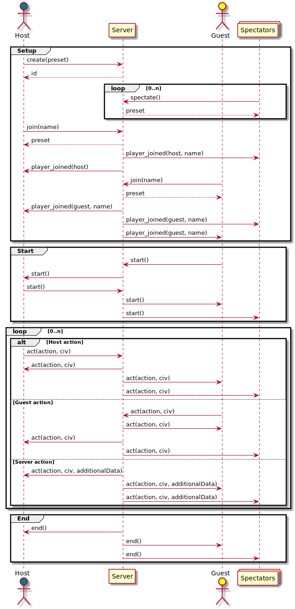

# Captains Mode for Age of Empires

This is a recreation of the original [aoe2cm by pip](https://github.com/aocpip/aoe2cm) 
with additional features such as snipe turns and user generated presets.

Age of Empires © Microsoft Corporation.
**Captains Mode for Age of Empires** was created under Microsoft's "[Game Content Usage Rules](https://www.xbox.com/en-us/developers/rules)" using assets from Age of Empires II, Age of Empires III, and Age of Empires IV,
and it is not endorsed by or affiliated with Microsoft.


## Setup

```bash
cp presets.json.template presets.json
cp alerts.json.template alerts.json
npm install
npm run build
node build/server.js
```

Visit `localhost:3000` then.

### Run Tests / Update snapshots

```bash
npm test
```

## Presets

A preset defines the order and modes in which host and guest pick and ban 
civilisations.

A preset is simply a list of turns that is being processed turn by turn.
The preset also has a name and defines the set of civilisations that can
be picked, like AoC only or everything up to RotR.

A turn consists of an acting player (host, guest, or none for technical 
turns such as revealing hidden picks/bans) and an action.

The following actions are available:

### User Actions

These actions are usually executed by the users (Host & Guest).

#### pick
select one of the civilisations for play

#### ban
prevent the opponent or both players (depending on modifiers) from picking the selected 
civilisation in a future turn

#### snipe
Ban one of the opponent's picks

### Modifiers

#### Exclusivity

There are three values for Exclusivity: `NONEXCLUSIVE`, `EXCLUSIVE`, and `GOBAL`.

A `GLOBAL` ban means that neither player may pick the civilisation in the future,  
an `EXCLUSIVE` ban means that the player *cannot* ban the civilisation again in the future,  
a `NONEXCLUSIVE` ban means that the player *can* ban the civilisation again in the future, 
but that makes no sense honestly, so don't use that.

A `GLOBAL` pick means that *neither player* may pick the civilisation *again* in the future,  
an `EXCLUSIVE` pick means that the player *cannot* pick the civilisation again in the future,  
a `NONEXCLUSIVE` pick means that the player *can* pick the civilisation again in the future.


#### Hidden

A hidden pick or ban is not shown to the opponent or spectators until it is revealed by an admin `REVEAL` action.

#### Parallel

During a parallel turn, both players execute their respective action at the same time. 
The turn is over once both players have completed their respective action or have run out of time.
To configure a parallel turn, create two turns and mark the *first* one as parallel.


### Admin actions

These actions can only be executed by the server.

#### reveal picks
show all hidden picks to all players and spectators

#### reveal bans
show all hidden bans to all players and spectators; should be done 
after hidden bans before the next picks

#### reveal snipes
show all hidden snipes to all players and spectators

#### reveal all
reveal picks, bans, and snipes

## Validations

Each action gets validated by the server before it is broadcasted.
If one or more validations fail, an error is returned to the player and the
action is not broadcasted.

### Validations for all actions:
- `VLD_000`: Draft is currently expecting actions 
- `VLD_001`: Acting user is supposed to act according to preset 
- `VLD_002`: Action is expected according to preset

### Validations for PICKs, BANs, and SNIPEs: 
- `VLD_010`: Action is not permissible with that civilisation


## Messages



## Translations
If you would like to see this app in one of the languages in which it isn't 
translated yet, you are welcome to submit the translations &ndash; provided 
you are willing to volunteer to keep it up to date in the future as well 😁

### How to submit
You can  make a copy of [this file](src/languages/en_GB.json), translate it and 
submit the new file with translations via a 
PR ([example here](https://github.com/SiegeEngineers/aoe2cm2/pull/45)). 
Or, share the file with `hszemi` or `jester_5115` on Discord.

### Current locale maintainers

- `de_DE`: hszemi
- `en_GB`: hszemi
- `es_ES`: walls_and_bridges
- `fr_FR`: phare_macie
- `pt_BR`: marciocolombia
- `pl_PL`: nerfoxingaround
- `zh_CN`: heavenlychorus
- `zh_TW`: zerocores

## Deploying

Locally:
```shell
export NODE_OPTIONS=--openssl-legacy-provider
npm run build-client
rsync -avzP build/* aoe2cm:~/aoe2cm2/build
# or rsync -avzP build/* aoe2se:~/aoe2cm2/build for the staging environment
```

On the server:
```shell
git pull --rebase
./deploy.sh
```

## Housekeeping

To move all drafts older than X days to another folder, execute the following in `data/current`:

```sh
for f in `find . -ctime +X`; do mv $f ../another-folder/; done
```

## Adding users

Generate a new password salted and hashed with bcrypt, e. g. using htpasswd:

```sh
$ htpasswd -nbB user password
user:$2y$05$Kqxufpc5Vawgbhmv8xf/..SrY2LvuPSerYcn/4HgkC5hjsOWXmp2e
```

Create or edit `users.json` and add the username and hash as key-value pair.
The bcrypt implementation does not like the 2y format, simply replace the 2y at the beginning with 2b.

```json
{
  "user": "$2b$05$Kqxufpc5Vawgbhmv8xf/..SrY2LvuPSerYcn/4HgkC5hjsOWXmp2e"
}
```
